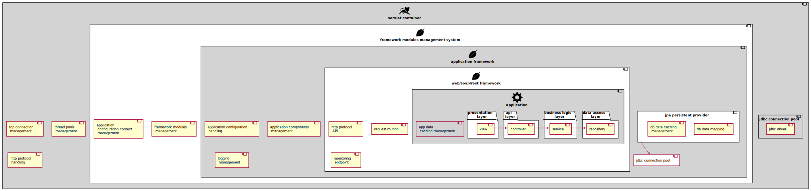
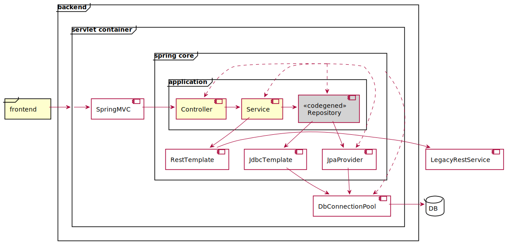
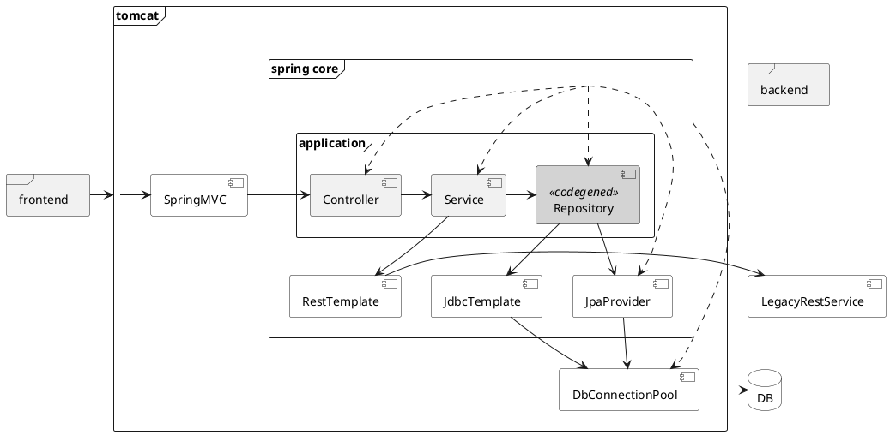

App overview
============

Application components
----------------------

<details>
<summary>puml</summary>

```puml
@startuml
!define ICONURL https://raw.githubusercontent.com/tupadr3/plantuml-icon-font-sprites/v2.1.0/devicons
!includeurl ICONURL/coda.puml
!define SPRITESURL https://raw.githubusercontent.com/rabelenda/cicon-plantuml-sprites/v1.0/sprites
!includeurl SPRITESURL/server.puml
!includeurl SPRITESURL/linux.puml
!includeurl SPRITESURL/docker.puml
!includeurl SPRITESURL/java.puml
!includeurl SPRITESURL/tomcat.puml
!includeurl SPRITESURL/cog.puml


component "<$tomcat>\nservlet container" as web_container #lightgray {
    [tcp connection \n management]
    [thread pools \n management]
    [http protocol \n handling]
              
    component "jdbc connection pool" as container_cp {
        [jdbc driver]
    }

    component "<$coda>\nframework modules management system" as spring_boot #white {
        [framework modules \n management]
        [application \n configuration context \n management]

        component "<$coda>\napplication framework" as spring_core #lightgray {
            [application configuration \n handling]
            [application components \n management]
            [logging \n management]

            component "jpa persistent provider" as jpa #white {
                [db data mapping]
                [db data caching]
            }
            
            component "jdbc connection pool" as app_cp {
                [jdbc driver]
            }
            jpa --> app_cp

            component "<$coda>\nweb/soap/rest framework" as spring_mvc #white {
                [http protocol \n API]
                [request routing]
                [monitoring \n endpoint]

                component "<$cog>\napplication" as app #lightgray {
                    [app data \n caching management] #lightgray 
                    
                    package "data access \n layer" as dal #white {
                        [repository]
                    }
                    
                    package "business logic \n layer" as bl #white {
                        [service]
                    }
                    
                    package "api \n layer" as cl #white {
                        [controller]
                    }
                    
                    package "presentation \n layer" as pl #white {
                        [view]
                    }

                    service -> repository 
                    controller -> service
                    view -> controller
                }
            }
        }
    }
}
@enduml
```
</details>

Data access architecture
------------------------

<details>
<summary>puml</summary>


</details>


Build and Run
=============

Setup Maven configuration [in case of corporate Maven repo]
-------------------------
```shell
vi maven-settings.xml
cp maven-settings.xml $M2_HOME/conf/settings.xml
```

Build with Maven or Gradle
--------------------------
```shell
mvn clean verify [-DexcludedGroups="nope" -Dgroups=""]
gradle clean check bootJar [jacocoTestReport pitest -i --scan --no-build-cache -DexcludedGroups='nope' -Dgroups=""]
```

Run app with embedded Derby DB
------------------------------
```shell
java -Dderby.stream.error.file=log/derby.log -jar target/dbo-app.jar --spring.profiles.active=qa
```
open [http://localhost:8080/dbo/swagger-ui/](http://localhost:8080/dbo/swagger-ui/)

Run app with stand-alone Derby server DB
----------------------------------------
```shell
target/db-derby-10.13.1.1-bin/bin/startNetworkServer &
java -jar target/dbo-app.jar --spring.profiles.active=qa2
```

Run legacy system stub while QA [optional]
-------------------------------
```shell script
cd target/test-classes # cat mappings/legacyAccountingSystemResponse.json
java -jar wiremock-jre8-standalone-2.28.1.jar --verbose --port 8888 # curl localhost:8888/api/account
``` 

Build and run Docker container for Application [optional]
----------------------------------------------
```bash
docker build -t acme/dbo .

docker run -d -p 8080:8080 --name dbo acme/dbo
docker exec -it dbo /bin/sh
```
```bash
docker rm dbo -f
```

Application graceful shutdown
-----------------------------
```
curl --request POST http://localhost:8080/dbo/actuator/shutdown
```
