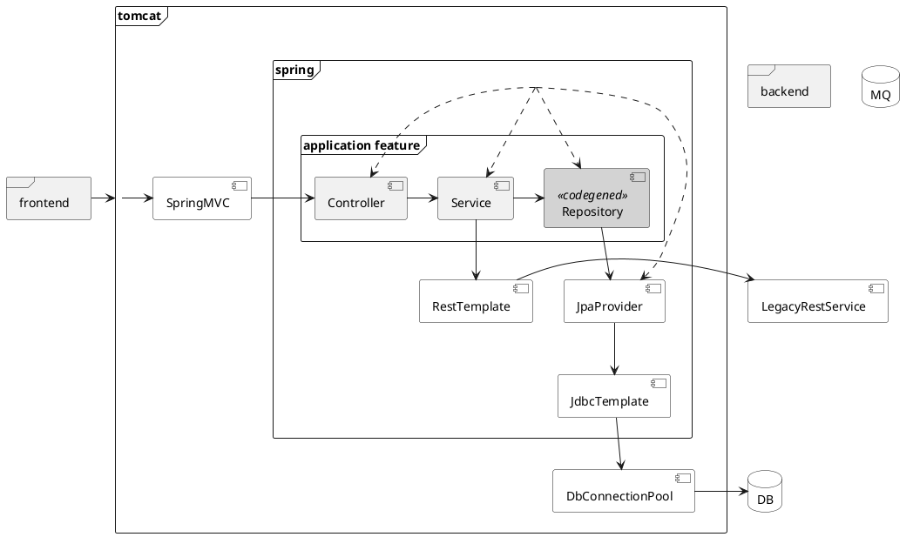

# Application architecture

<details>
<summary>puml</summary>


</details>

# Setup Maven configuration [in case of corporate Maven repo]
```shell
vi maven-settings.xml
cp maven-settings.xml $M2_HOME/conf/settings.xml
```

# Build with Maven or Gradle
```shell
mvn clean verify [-DexcludedGroups="nope" -Dgroups=""]
gradle clean check bootJar [jacocoTestReport pitest -i --scan --no-build-cache -DexcludedGroups='nope' -Dgroups=""]
```

# Run app with embedded DB
```shell
java -Dderby.stream.error.file=log/derby.log -jar target/dbo-1.0-SNAPSHOT.jar --spring.profiles.active=qa
```
open [http://localhost:8080/dbo/swagger-ui/](http://localhost:8080/dbo/swagger-ui/)

# Run app with stand-alone server DB
```shell
target/db-derby-10.13.1.1-bin/bin/startNetworkServer &
java -jar target/dbo-1.0-SNAPSHOT.jar --spring.profiles.active=qa2
```

# Run legacy system *stub* while QA [optional]
```shell script
cd target/test-classes # cat mappings/legacyAccountingSystemResponse.json
java -jar wiremock-jre8-standalone-2.26.3.jar --verbose --port 8888 # curl localhost:8888/api/account
``` 

# Build and run Docker container for Application [optional]
```bash
docker build -t acme/dbo:1.0-SNAPHOT-it .

docker run -d -p 8080:8080 --name dbo acme/dbo:1.0-SNAPHOT-it
docker exec -it dbo /bin/sh
```
```bash
docker rm dbo -f
```

# Application graceful shutdown
```
curl --request POST http://localhost:8080/dbo/actuator/shutdown
```
