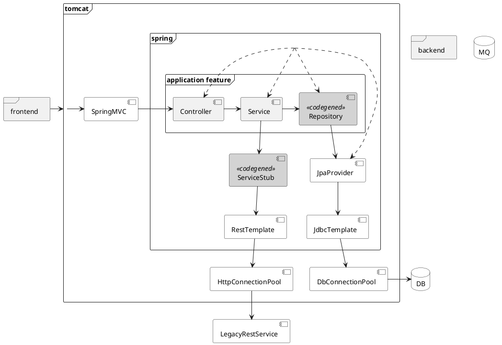

# Application architecture

<details>
<summary>puml</summary>


</details>

# Install environment
```shell
sudo apt install openjdk-8-jdk-headless
sudo apt install maven
```

# Setup Maven configuration [in case of corporate Maven repo]
```shell
vi maven-settings.xml
cp maven-settings.xml $M2_HOME/conf/settings.xml
```

# Build with Maven
```shell
mvn clean verify -Djava.awt.headless=true -DdependencyLocationsEnabled=false -Dlogback.configurationFile=logback-quiet.xml [-DexcludedGroups="nope" -Dgroups=""]
```

# Build with Gradle
```shell
gradle clean check bootJar [jacocoTestReport pitest -i --scan --no-build-cache -DexcludedGroups='nope' -Dgroups=""]
```

# Run raw release locally
```shell
java -Dderby.stream.error.file=log/derby.log -jar target/dbo-1.0-SNAPSHOT.jar [--spring.profiles.active=qa]
```
- http://localhost:8080/dbo/swagger-ui.html

# Optional run legacy system *stub* while QA
```shell script
cd target/test-classes # cat mappings/legacyAccountingSystemResponse.json
java -jar wiremock-jre8-standalone-2.26.3.jar --verbose --port 8888 # curl localhost:8888/api/account
``` 

# Optional build and run Docker container for Application
```bash
docker build -t acme/dbo:1.0-SNAPHOT-it .

docker run -it -d -p 8080:8080 --name dbo acme/dbo:1.0-SNAPHOT-it
docker attach dbo
docker exec -it dbo /bin/sh

docker rm dbo -f
```

# Graceful shutdown
```
curl --request POST http://localhost:8080/dbo/actuator/shutdown
```

## Ручное копирование приложения на пре-прод и запуск
- Ручное копирование scp
```bash
mvn package -DskipTests -Djava.awt.headless=true -DdependencyLocationsEnabled=false -Dlogback.configurationFile=logback-quiet.xml
scp -i ~/Dropbox/Eugene/Backups/agile-practices-dev.pem target/dbo-1.0-SNAPSHOT.jar admin@84.201.157.139:/home/dboadmin/dbo/
```

- Ручное копирование через Maven Repo
```bash
mvn deploy -s ansible/files/maven-settings.xml -DskipTests -Djava.awt.headless=true -DdependencyLocationsEnabled=false -Dlogback.configurationFile=logback-quiet.xml
ssh -i ~/Dropbox/Eugene/Backups/agile-practices-dev.pem admin@84.201.157.139
admin@pre-prod:/home/dboadmin/dbo$ mvn -s /home/bambooagent/.m2/settings.xml org.apache.maven.plugins:maven-dependency-plugin:2.4:get -Dtransitive=false -Dartifact=com.acme.banking:dbo:1.0-SNAPSHOT -Ddest=/dbo/dbo-1.0-SNAPSHOT.jar -DremoteRepositories=dbo-artifacts-server::::http://84.201.134.115:8081/artifactory/dbo 
```

- Ручной запуск и остановка как приложения
```bash
admin@pre-prod:/home/dboadmin/dbo$ nohup java -Dcom.sun.management.jmxremote -Dcom.sun.management.jmxremote.port=9999 -Dcom.sun.management.jmxremote.authenticate=false -Dcom.sun.management.jmxremote.ssl=false -Djava.rmi.server.hostname=84.201.157.139 -jar /dbo/dbo-1.0-SNAPSHOT.jar &
admin@pre-prod:/home/dboadmin/dbo$ ps -af

admin@pre-prod: pkill -9 -f "dbo-1.0-SNAPSHOT.jar"
```

- Запуск и остановка приложения как сервиса
```bash
[admin@pre-prod:/$ [/bin/sh -c '] sudo systemctl daemon-reload]
[admin@pre-prod:/$ [/bin/sh -c '] sudo systemctl enable dbo-app.service]

admin@pre-prod:/$ sudo systemctl status dbo-app.service

curl --request POST http://84.201.157.139:8080/dbo/actuator/shutdown
```

## Подключение к работающему приложению
```bash
curl --request POST http://84.201.157.139:8080/dbo/actuator/
```
- jvisualvm -> Add remote JMX connection 84.201.157.139:9999
